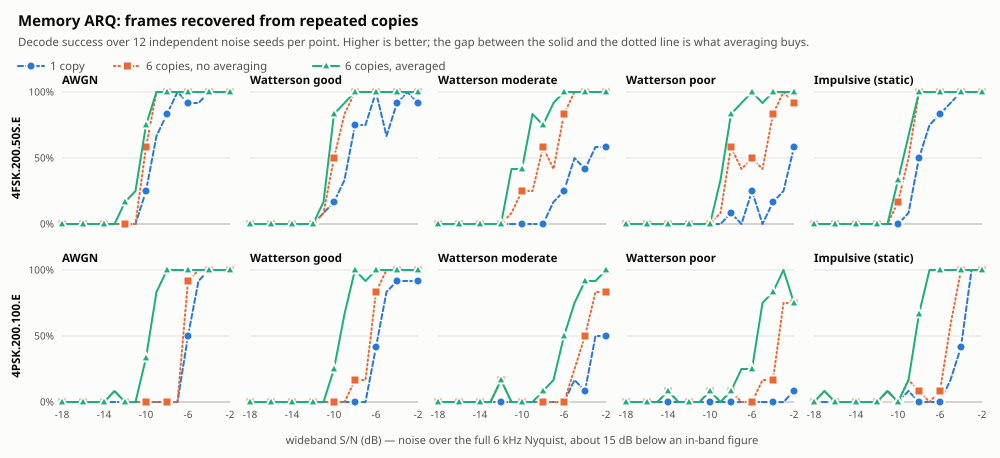

# 18 — Memory ARQ under HF channels

Memory ARQ was implemented against additive white Gaussian noise, and AWGN is
the easy case: repeated copies are independent, so averaging *N* of them buys
the textbook improvement almost by definition. Real HF is fading and static
crashes, where the copies are not independent in the same way and the answer is
not obviously the same. Averaging a channel that has rotated the signal's phase
between copies could plausibly do nothing, or make things worse.

This document is the measurement. **It helps on every channel tested**, but by
very different amounts depending on the modulation, and the reason for that
difference points at where the next improvement is.

---

## 1. What is being measured

Decode success against **wideband S/N**: noise across the full 6 kHz Nyquist
band against a signal occupying a few hundred Hz. That reads roughly 15 dB below
the in-band figure an operator would quote for a 200 Hz frame. The absolute
numbers here are therefore not comparable to an on-air S/N report — what matters
is that the definition is identical across every comparison below.

Three arms, on **identical audio**:

| Arm | What it is |
|---|---|
| **1 copy** | One reception, decoded alone. The pre-Memory-ARQ baseline. |
| **6 copies, no averaging** | Six receptions, accumulator dropped between each. Six independent chances and nothing else. |
| **6 copies, averaged** | The same six receptions, accumulated. |

The middle arm is the one that matters. Comparing against a single copy would
flatter the feature, because six chances at anything are better than one
regardless of what the decoder does with them. The honest question is what the
*averaging* adds on top of the retries, so the copies are generated once and
decoded twice — same samples, same order, same demodulator — with the only
difference being whether the accumulator survives between them.

Twelve independent noise seeds per point, S/N from −18 to −2 dB in 1 dB steps,
two modulations, five channels: 170 points, 6,120 decodes.

### Channels

| Channel | Model |
|---|---|
| **AWGN** | Additive white Gaussian noise. |
| **Watterson good** | Two Rayleigh paths, 0.5 ms apart, 0.1 Hz Doppler spread. |
| **Watterson moderate** | Two paths, 1 ms, 0.5 Hz. |
| **Watterson poor** | Two paths, 2 ms, 1 Hz. |
| **Impulsive** | Poisson static crashes: 3/s, 8× signal RMS, 2 ms long. |

Watterson is the standard HF ionospheric model (ITU-R F.1487) and the three
conditions are its reference severities. The fading is applied to the
**analytic** signal, so each path's tap gain rotates phase as well as scaling
amplitude. Applying a real-valued envelope instead would be a far gentler
channel than a real ionospheric path, and would flatter a PSK decoder
specifically — phase is exactly what it depends on.

---

## 2. Results

<picture>
  <source media="(prefers-color-scheme: dark)" srcset="img/memarq-channels-dark.svg">
  
</picture>

S/N at which each arm first reaches 50% decode success, linearly interpolated.
More negative is better. Raw data: [`data/memarq-channels.csv`](data/memarq-channels.csv).

| Mode | Channel | 1 copy | 6, no avg | 6, averaged | **Gain vs. retries** | Gain vs. 1 copy |
|---|---|---:|---:|---:|---:|---:|
| 4PSK.200.100.E | AWGN | −6.0 | −6.5 | **−9.7** | **3.2 dB** | 3.7 dB |
| 4PSK.200.100.E | Watterson good | −5.8 | −6.5 | **−9.4** | **2.9 dB** | 3.6 dB |
| 4PSK.200.100.E | Watterson moderate | −3.0 | −4.0 | **−6.0** | **2.0 dB** | 3.0 dB |
| 4PSK.200.100.E | Watterson poor | — | −3.4 | **−5.5** | **2.1 dB** | — |
| 4PSK.200.100.E | Impulsive | −3.9 | −5.2 | **−8.3** | **3.2 dB** | 4.5 dB |
| 4FSK.200.50S.E | AWGN | −9.4 | −10.1 | **−10.5** | **0.4 dB** | 1.1 dB |
| 4FSK.200.50S.E | Watterson good | −8.6 | −10.0 | **−10.5** | **0.5 dB** | 1.9 dB |
| 4FSK.200.50S.E | Watterson moderate | −5.0 | −8.2 | **−9.8** | **1.6 dB** | 4.8 dB |
| 4FSK.200.50S.E | Watterson poor | −2.2 | −8.2 | **−8.7** | **0.5 dB** | 6.4 dB |
| 4FSK.200.50S.E | Impulsive | −8.0 | −9.0 | **−9.5** | **0.5 dB** | 1.5 dB |

*"—" means that arm never reached 50% anywhere in the swept range.*

---

## 3. What it says

**Fading does not break it.** This was the open question, and the answer is no.
4PSK gains 2.9 dB under Watterson *good* against 3.2 dB under AWGN, and still
2.0–2.1 dB under moderate and poor. The concern that phase rotation between
copies would make phase averaging useless was reasonable and is wrong: the
Doppler spreads that matter here (0.1–1 Hz) are slow next to a frame, so within
any one copy the phase reference is stable enough for the average to be
meaningful.

**Impulsive noise does not break it either.** 4PSK gains 3.2 dB under static
crashes — the same as under AWGN — and the gain over a single copy is the
largest in the table for that mode, at 4.5 dB. A crash ruins the copy it lands
in; averaging dilutes it.

**PSK gains far more than FSK: 2.0–3.2 dB against 0.4–1.6 dB.** This is the
most useful result here, and it is not noise. The reason is where the averaging
sits relative to the decision:

- PSK accumulates **soft** information. Phase is a continuous quantity, and
  averaging six noisy phases genuinely recovers the underlying one.
- 4FSK accumulates four tone magnitudes and then takes an **argmax**. The
  averaging happens before a hard decision that throws most of the information
  away, so most of what averaging recovered is discarded at the moment of
  choosing.

That suggests the obvious next step for 4FSK: carry the averaged tone
magnitudes into the Reed–Solomon stage as erasure or reliability information
rather than collapsing them to a byte first. That is a larger change than
Memory ARQ itself and is not attempted here.

**Under severe fading, most of the benefit is the retries, not the averaging.**
The two gain columns diverge sharply for 4FSK: 6.4 dB against a single copy
under Watterson poor, but only 0.5 dB against six independent chances. A single
copy on a badly fading path is at the mercy of where the fade falls; simply
trying six times recovers most of that, and averaging adds a little on top.
Reporting only the "vs 1 copy" column would have made Memory ARQ look far more
valuable than it is, which is why the control exists.

**One qualitative change.** 4PSK under Watterson poor never reaches 50% on a
single copy anywhere in the swept range, but reaches it at −5.5 dB accumulated.
On the worst modelled path, this is the difference between a mode that
essentially does not work and one that does.

---

## 4. Limits

Stated plainly, because the numbers above will otherwise be read as more than
they are.

1. **Simulated channels, not measured ones.** Watterson is the standard model
   and these are its reference conditions, but a model is not a band. Nothing
   here has been on the air.
2. **Two modulations of the seventeen.** 4PSK.200.100.E and 4FSK.200.50S.E,
   both single-carrier, chosen so the averaging is measured without the separate
   effect of combining carriers recovered from *different* copies. Multi-carrier
   and 16QAM modes are unmeasured, and the carrier-combining effect — which may
   be the larger one for them — is not captured at all.
3. **Six copies.** Not swept. Whether the gain saturates at three or keeps
   climbing at twelve is unknown, and it bears directly on how long a station
   should keep retrying before giving up.
4. **50% success is an arbitrary threshold.** It is where interpolation is most
   stable; it is not an operating point anyone would choose.
5. **Twelve seeds** gives roughly ±14% on a proportion near 50%, so individual
   0.4–0.5 dB figures are near the noise floor of the measurement. The 2–3 dB
   PSK gains are well clear of it; the small FSK gains should be read as "small
   and positive", not as their exact values.
6. **The per-symbol normalisation in the 4FSK path is unvalidated.** It exists
   to stop one loud copy swamping several clean ones, and the impulsive-channel
   column was meant to demonstrate it. It does not: 4FSK gains 0.5 dB under
   impulsive against 0.4 dB under AWGN, which is within the noise. The
   normalisation is defensible on first principles and is not hurting, but this
   measurement does not show it helping.

---

## 5. Reproducing

```sh
make memarq-bench
./tools/memarq_sweep.py --out results.csv --seeds 12 \
    --snr-min -18 --snr-max -2 --snr-step 1     # ~40 min
./tools/memarq_plot.py results.csv --outdir analysis/img
```

`tools/hf_channel.py` holds the channel models, `tools/memarq_bench.c` the
modulate-and-decode harness. The fast in-process version of the same idea, which
runs as part of `make test-core`, is `test/core/test_memarq.c`.

The charts are generated, not drawn: re-running the last command after a change
to the decoder regenerates them from the new data.
