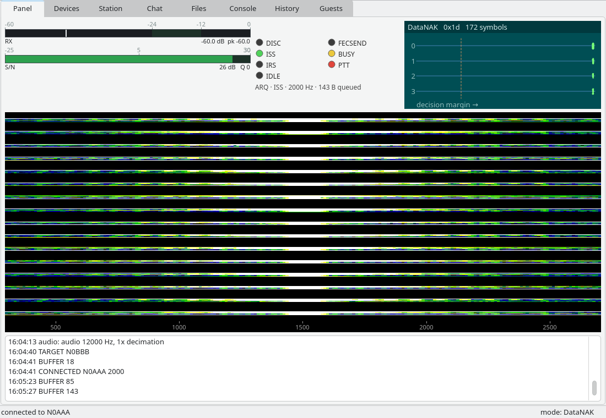
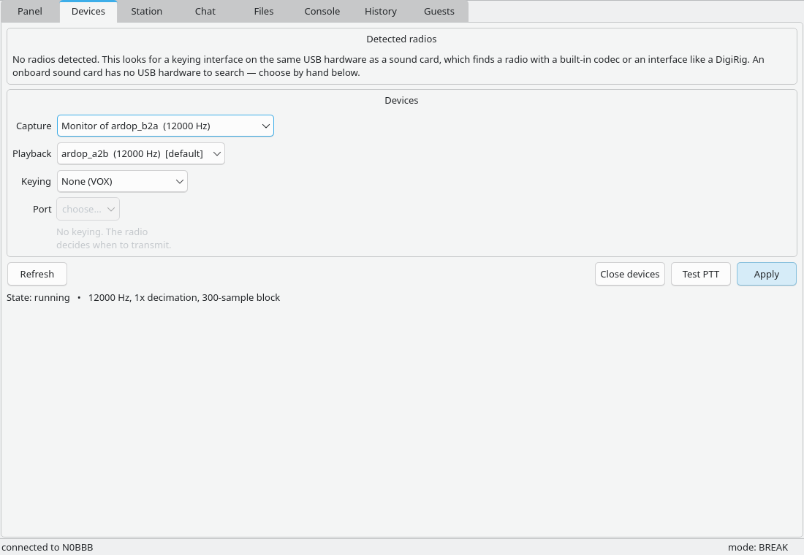
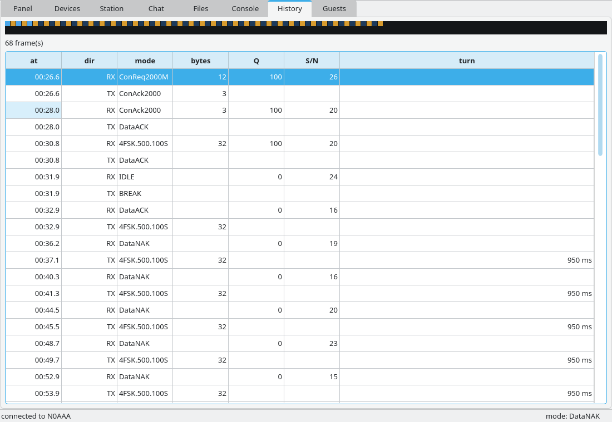
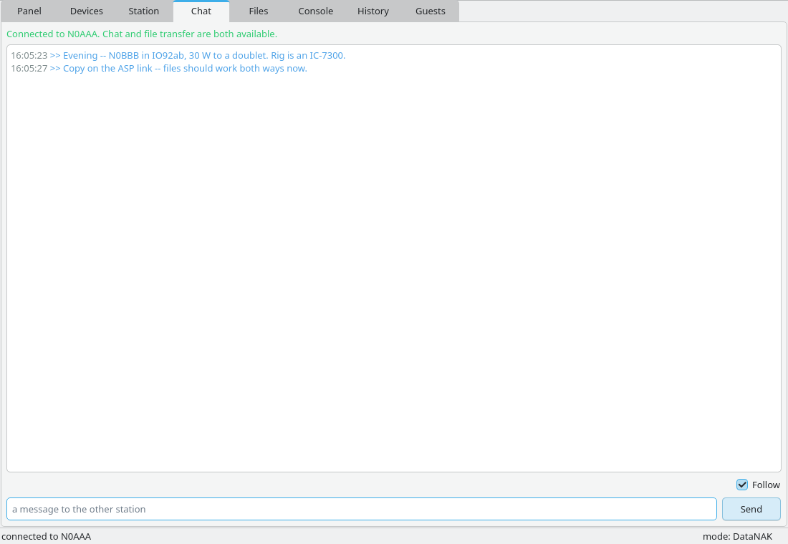
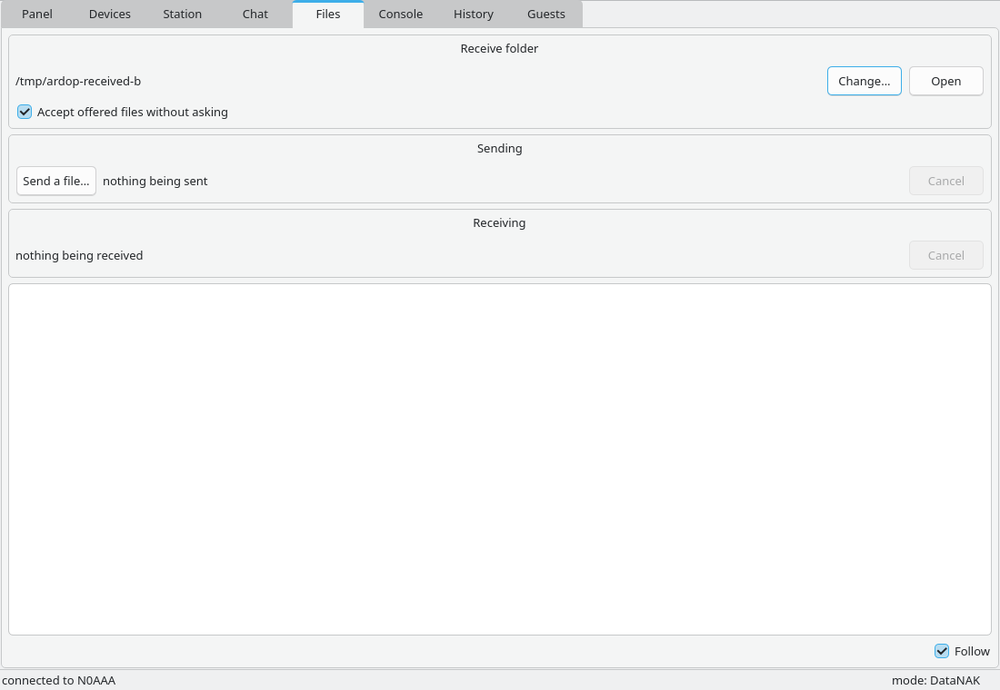
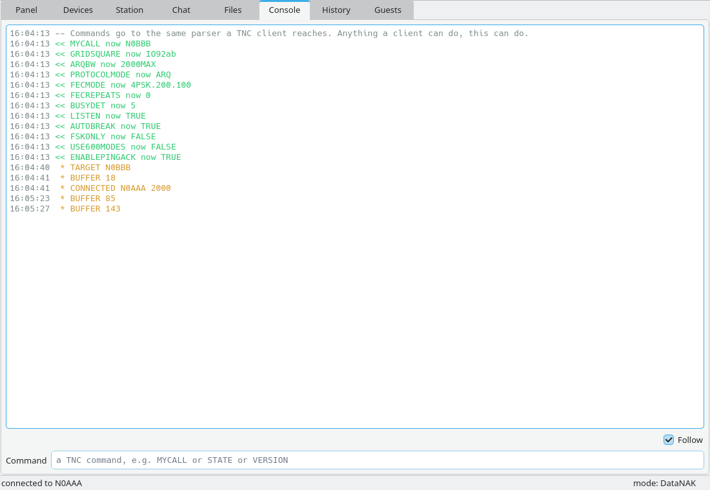

# ardop-station

**A complete HF data station in one window: the modem, the radio, the link, and
what you actually wanted to send.**

Everything below is one executable with the modem compiled into it. There is no
daemon to start first, no port to configure, no second program watching the
first, and no config file to hand-edit before anything works.



---

## Why this exists

An ARDOP station has historically been three or four programs in a trenchcoat: a
modem daemon that owns the sound card, a terminal to type commands at it, a
separate display to watch the waterfall, and something else again to move a file.
Each one has its own idea of what the station's callsign is. When something goes
wrong — and on HF something is always going wrong — none of them can tell you
which part failed.

This is one program that knows all of it at once.

### It finds your radio



Modern radios are one USB cable carrying both the audio and the keying. The
Devices screen looks for a keying interface on the same physical USB hardware as
each sound card, which finds an IC-7300 or an FT-991A by its built-in codec, and
finds a DigiRig by walking one level further up to the hub it puts its sound card
and its serial bridge behind.

You get a suggestion with a **Test PTT** button beside it. Nothing is ever
applied silently, because a wrong guess keys a transmitter.

Keying can be RTS, DTR, CM108 GPIO, or a CAT command spoken directly to the rig —
no `rigctld` to run, no hamlib model number to look up. If your radio is a Xiegu,
that last one matters: every Xiegu keys by CAT command and an RTS line does
nothing at all.

Your choice is remembered. If the cable falls out mid-session you get a fault you
can act on and a device list to pick from again, rather than a dead program.

### It shows you what the channel is doing

The waterfall, the constellation, and a receive-level meter with a band on it —
because "too quiet" and "too loud" are both faults, and a meter that is green
everywhere below the danger line will happily tell you that 40 dB too little
audio is fine.



The History screen is the one that answers *why is this link slow*. Every frame
sent and heard, with its mode, its quality, its signal-to-noise, and — the number
nobody else shows you — the **turnaround time**: how long between hearing the
other station finish and starting to transmit. If that number is 900 ms, your
throughput problem is not the band.

### It talks to other stations, in words and in files



Chat works with anyone. Stations running this program get a framed protocol;
stations running plain `ardopcf` or a terminal get plain text, in both
directions, automatically, and the screen tells you which you have. Rag-chewing
with someone who has never heard of this program is a feature, not a fallback.



File transfer carries a **name**, a **size** and a **CRC-32**, and tells you when
it is done. Interrupted at 60% by a dropped link? Reconnect and it resumes from
where it stopped — after checking that the bytes already on disk really are that
file's first bytes, so a half-download of something else cannot be silently glued
onto the front. Offers are refused by default; a station that automatically
accepts arbitrary files from any caller will eventually receive something its
operator did not want.

Received files land in one folder you choose, never a path derived from what the
other station sent. Filenames from strangers are sanitised before they go
anywhere near your disk.

### It hosts your other software

Already running Pat or Winlink Express? Turn on the TNC interface and they talk
to *this* program instead of needing a separate modem beside it. The Guests
screen shows which client is attached, that it currently owns the link, and every
command it ran — including when it changes your callsign, which Pat does during
startup.

### And it does not hide anything from you



The Console is the same command parser a TNC client reaches. Anything a client
can do, you can do, and you can see exactly what the modem said back. When a Pat
session misbehaves, this is the screen that shows what was actually exchanged
rather than a summary written by the thing under suspicion.

There is also a `--remote` mode that shows only the panel, pointed at another
station's telemetry port. It cannot transmit, structurally: the source it is
handed has no way to command anything.

---

## Building and running

The C half builds with `make`; the window is a separate CMake project so the two
build systems stay out of each other's way.

```sh
make lib
cmake -S app/ui -B app/ui/build -G Ninja -DCMAKE_BUILD_TYPE=Release
cmake --build app/ui/build
./app/ui/build/ardop-station
```

Needs Qt 6 (`qt6-base` — Widgets and Network; no declarative module). On Windows,
MSYS2/MinGW; prebuilt binaries are attached to the rolling `continuous`
prerelease.

First run opens the system default sound card so the program comes up working
rather than dark. Go to **Devices**, pick your radio, set a callsign on
**Station**, and you are on the air.

Settings live in `$XDG_CONFIG_HOME/ardop/station.conf` (Linux) or
`%APPDATA%\ardop\station.conf` (Windows). It is `key=value`, safe to edit by
hand, and keys it does not recognise are preserved.

---

## Testing it without a radio

Two stations over a pair of virtual audio cables, on one machine:

```sh
tools/loopback.sh up            # create the cables
tools/loopback.sh pipe          # transfer a file and verify it, end to end
tools/loopback.sh down
```

To drive the *window* over those cables, run two copies with separate config
directories, one pointed at each cable — see the checklist below, which is
exactly this arrangement.

---

# For testers

**This has never been run against a real radio by its authors.** Every claim
above is true of the code and verified against recordings, virtual cables and
unit tests; none of it has been verified against a transceiver, an antenna and
another operator. That is the gap you would be closing, and it is the reason this
section is as long as the sales pitch.

## What we most need to know

In rough order of how much it would change what we do next:

1. **Does it key your radio at all?** Which interface, which keying method, and
   did `--detect` / the Devices screen find it without help?
2. **Does a QSO complete with a station running something else** — plain
   `ardopcf`, Pat, Winlink Express, a different ARDOP implementation?
3. **What does the turnaround time say on a real path?** It is the number we
   have the least confidence in and the most interest in.
4. **Did anything key the transmitter that you did not ask to key it?** Drop
   everything and tell us.

## Validation checklist

Copy this into an issue and fill in what you got. **Partial is useful** — three
lines from a real radio beats a blank form.

### Devices and keying

- [ ] `--detect` (or the Devices screen) found the radio without being told
- [ ] Capture and playback devices are correct and survive a restart
- [ ] **Test PTT** keys the radio, and it unkeys again afterwards
- [ ] Keying method used: `rts` / `dtr` / `cm108` / `civ` / `kenwood` / `yaesu` / `rigctld` / VOX
- [ ] Unplugging the interface mid-session gives a fault you can recover from by
      reselecting, without restarting the program
- [ ] Receive level sits inside the meter's band with your rig's normal audio

### On the air

- [ ] ARQ connect to another station succeeds
- [ ] The other station's callsign appears in the status bar
- [ ] Chat works with a station running **this** program
- [ ] Chat works with a station **not** running it (plain text both ways)
- [ ] A file arrives byte-identical — check it, do not assume
- [ ] A transfer interrupted by a dropped link **resumes** rather than restarting
- [ ] Turnaround time on the History screen, and whether it looks plausible
- [ ] Gear shifting settles on a sensible mode for the conditions

### Hosting other software

- [ ] Pat / Winlink Express connects to the TNC interface
- [ ] The Guests screen shows the client and its commands
- [ ] Your own controls grey out while the guest holds the link, and come back
      when it disconnects

### Known-shaky areas, where we would not be surprised by a failure

- **CM108 keying has never been run against hardware.** The report bytes match
  direwolf's and hamlib's, the GPIO pin is refused if the chip does not have it,
  and that is the whole of our confidence. A CM108 write that succeeds proves the
  report reached the chip, **not that the radio keyed.**
- **The radio VID/PID table is small and partly vendor-level.** An unknown device
  falls back to the manual pickers. If your radio is misnamed or missed, the
  table is a plain text file and a one-line fix.
- **Two copies of the window on one machine over virtual cables** did not
  complete a transfer for us, while two `ardopb` daemons over the same cables did
  (`tools/loopback.sh pipe` passes). One direction NAKed every data frame. Not
  yet diagnosed, may well be our test rig rather than the program — but if you
  see something like it on a real path, that is very much worth knowing.
- **Windows at 125% and 150% display scaling.** The waterfall had a scaling bug
  that was invisible on a 100% display for months. It is fixed and tested at four
  scale factors, but the class of bug is one that hides from its author.
- **macOS and Android are not supported.** Linux and Windows only.

## Sending feedback

**Issues:** <https://github.com/rfb/ardopb/issues>

A good report has the boring parts in it:

```
Program version:   (Help/About, or `ardopb --version`)
OS and version:
Radio and interface:
Keying method:
Band and conditions:
The other station was running:

What happened:
What you expected:
```

Attach if you can:

- **The Console tab's transcript.** This is the single most useful thing you can
  send. It shows what was actually exchanged, not a summary.
- **The panel log** at the bottom of the Panel tab.
- **A screenshot**, especially of the History screen if it is a throughput or
  timing question.
- **Your `station.conf`** with anything you consider private removed.

Please do **not** send audio recordings unless we ask — they are large, and the
Console transcript usually answers the question faster.

### If it keyed something it should not have

Open an issue titled `SAFETY:` and say so in the first line. That class of bug
takes precedence over everything else here.

### If you would rather not use GitHub

An issue can be opened on your behalf — say what you saw to whoever pointed you
at this program, and ask them to file it. A report that reaches us second-hand is
worth far more than one that never gets written.

---

## For developers

The interface is deliberately thin. Everything it can do goes through
[`app/spine.h`](../spine.h), which is the only header it includes from the modem
side, and every crossing is a lock-free ring with the thread that may touch it
written on it. `app/ui/` holds one class per screen and nothing else:

| | |
|---|---|
| `modemthread.*` | the modem on its own thread; every public method is interface-thread safe |
| `spinesource.*` | drains the two upward queues and re-emits them as Qt signals |
| `aspsession.*` | the chat/file protocol, on the interface thread |
| `transcript.*` | the shared escaped log widget used by three screens |
| `*page.*` | one screen each |

`test_widgets.cpp` asserts the things that are mechanical and would otherwise be
silent: the waterfall's one-row-per-device-pixel blit at four scale factors, the
level meter's ballistics being time-invariant, the history ring's turn-time
arithmetic across a wrap, that the transcript renders a peer's markup as text,
and that a chat session follows the link rather than merely "not DISC".

```sh
cmake --build app/ui/build --target check-widgets
```

The design documents are worth reading before changing anything here:
[16 — the user interface](../../analysis/16-user-interface.md) and
[17 — the application protocol](../../analysis/17-application-protocol.md), both
of which carry an amendments section recording every place the design and the
built thing disagreed, and why.
