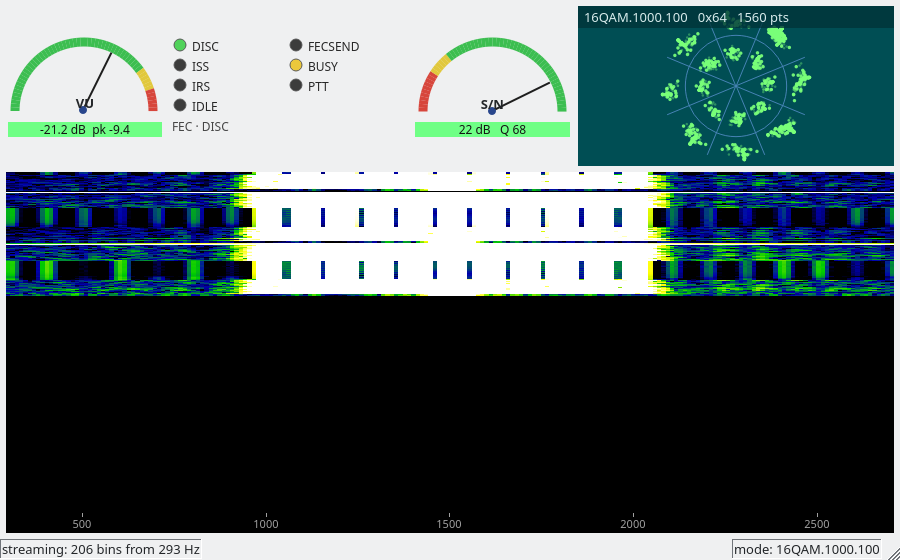

# ardop-gui

An instrument panel for a running `ardopb`: waterfall, constellation, S/N,
audio input level and link state, in the layout HF operators already know from
VARA.

It is a **separate process** that attaches to the modem's telemetry stream. The
modem stays headless and Qt is not one of its dependencies, so a daemon on a
Raspberry Pi is unaffected by this existing — and because the stream is one-way,
you can point the panel at a remote station's TNC without handing anyone a
transmitter.



*Receiving `16QAM.1000.100` — a four-carrier mode, 1560 symbols, all sixteen
clusters resolved (eight phase sectors × two amplitude rings).*

## Build

Needs Qt 6 and CMake. On Debian/Ubuntu:

```
sudo apt install qt6-base-dev cmake
```

Then, from the repository root:

```
cmake -S gui -B gui/build
cmake --build gui/build -j
```

Only `shell/telemetry.c` is compiled in from the modem, so the wire format has a
single definition shared by the writer and the reader. Nothing else of the C
tree is linked.

## Run

Start the modem with a telemetry port, then attach:

```
ardopb N0CALL --alsa default default --host 8515 --telemetry
./gui/build/ardop-gui --host 127.0.0.1:8517
```

`--telemetry` with no argument uses `--host` + 2, so 8515 gives 8517 (8515 is
the command channel, 8516 the data channel). Give it an explicit port if you
want something else. Without `--telemetry` the modem computes and sends nothing,
which is the default.

The panel reconnects on its own, so it can be started before the modem and
survives one being restarted under it.

## What the panels show

**Waterfall** — the receiver's passband, ~293 to 2695 Hz, one row per 1024
samples (about 11.7 rows a second). Levels auto-range against a slowly tracked
noise floor, because absolute magnitudes depend on your sound card's gain
staging, which the modem cannot know.

**Mode** — the last decoded frame's mode name (`4PSK.200.100`, `16QAM.1000.100`
— the same names `FECMODE` takes) is shown on the constellation and kept in the
status bar, where it stays readable. Names come from the modem's own frame
table, linked in rather than transcribed, so they cannot drift from the
protocol.

**Constellation** — what the decoder's symbol decisions are actually doing.
Every ARDOP modulation is covered, each drawn against the decoder's own
thresholds rather than a generic overlay:

| mode | plot | boundaries, from the decoder |
|---|---|---|
| 4PSK | 4 clusters | ±π/4, ±3π/4 (`ardop_decode_psk_char`) |
| 8PSK | 8 clusters | ±π/8 + k·π/4 |
| 16QAM | 8 sectors × 2 rings = 16 | same phase sectors, plus the adaptive magnitude ring |
| 4FSK | 4 tone lanes | 25% decision-margin gate |

For the phase modes, points are the differential phase and magnitude the slicer
reads. Tight clusters well inside their sectors are confident decisions; points
smeared across a boundary are bits about to be wrong.

The 16QAM ring is not decorative — it is `car_mag_threshold`, the decoder's
*adaptive* per-carrier amplitude boundary, carried on the wire and averaged over
the frame's carriers. Points inside it decode as inner-ring symbols.

The phase plot is rotated by π/4 so 4PSK clusters land in the quadrants. ARDOP's
clusters actually sit *on* the axes with diagonal boundaries; rotating gives the
familiar four-quadrant picture at no cost to what is conveyed.

4FSK has no I/Q plane at all — it is detected by tone magnitude, not phase — so
plotting one would be a fiction. Instead it gets four lanes, one per tone, with
each symbol placed by how far the winning tone beat the runner-up (as per mille,
so the reading does not move with audio gain). Points hugging the right are
confident; a drift toward the dashed gate is a frame about to fail.

**S/N** — measured once per frame, on the leader. It holds between frames rather
than decaying, because it is a per-frame figure and not a continuous
measurement. Bands follow the convention VARA established: green above −10 dB,
yellow to −15, red below.

**VU** — capture level in dBFS, needle on RMS and peak in the caption. Red above
−6 dBFS: the demodulator wants headroom, and a clipping input wrecks the
constellation before it shows up as a decode failure.

**Lamps** — ARDOP's own link states (DISC / ISS / IRS / IDLE / FECSEND) rather
than VARA's labels, which mean different things, plus BUSY and PTT.

## Not here yet

bps history, CPU and AFC gauges. The telemetry channel has room for them; they
were deferred to keep the first version to the panels that help you tune a radio.
